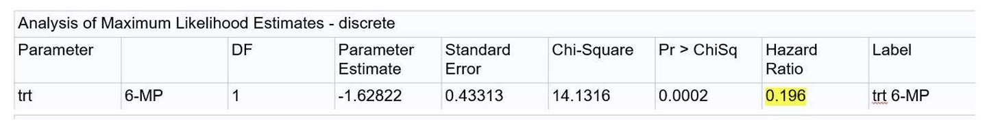

# Problem1

Construct 95% CI for the hazard ratio from a PH model shown in the follow table for the risk reduction between two treatment groups.




```{r}

```

# Problem2

The observed survival data $(T_i, \Delta_i,Z_i ) i =1,2,3,4,5,6$ are (16,1,1), (20,0,1), (12,1,0), (14,0,0), (11,1,0), (9,1,1). Please construct the partial likelihood.

```{r}

```

# Problem3

Show that PH model score test is the same as the log-rank test for an indicator covariate when there is no ties.

```{r}

```

